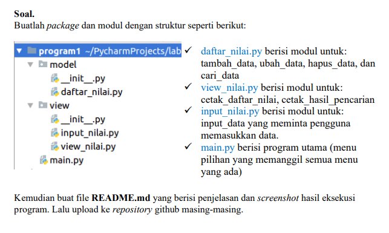
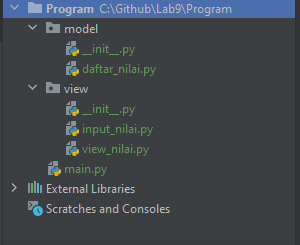
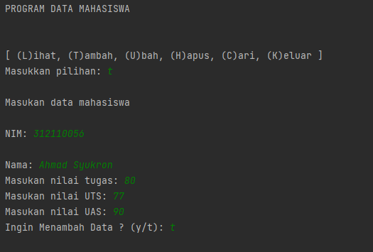
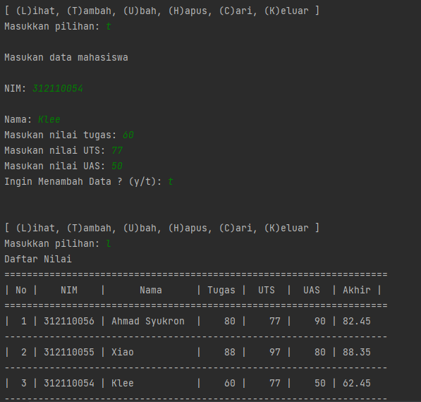
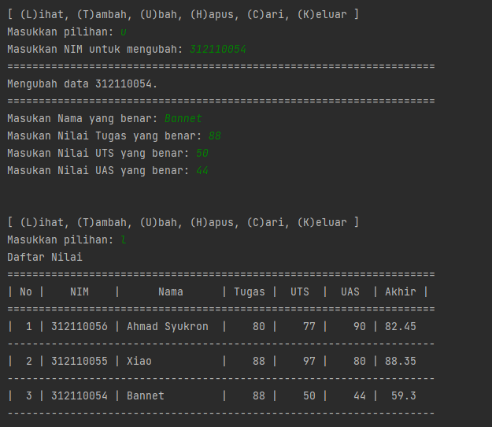
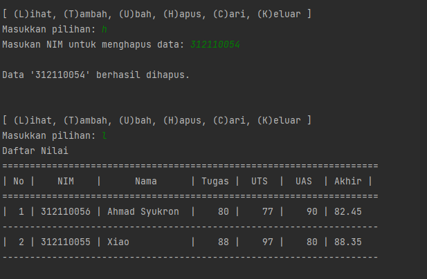
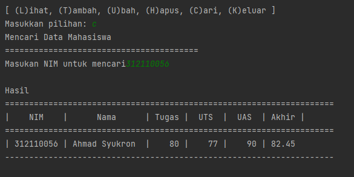
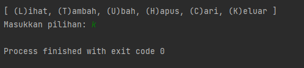

<body>
    <table border="1">
        <tr>
            <th> Nama</th>
            <th>NIM</th>
            <th>Kelas</th>
        </tr>
        <tr>
            <td>Ahmad Syukron</td>
            <td>312110056</td>
            <td>TI.21.A.1</td>
        </tr>
    </table>
</body>

# UAS
## Soal Ujian

### Stuktur Package dan Modul
<p>
- Didalam <b>Package Model</b> ada file python dengan nama daftar_nilai, didalam nya saya memberi fungsi proses program.<p>
- codingan proses dari file <b>daftar_nilai.py</b>
```bash
from view.input_nilai import *

mahasiswa = {}

# Menambahkan data mahasiswa
def tambah():
    global mahasiswa
    ulangi = "y" or "Y"
    while ulangi == "y" or "Y":
        nim = input_nim()
        nama = input_nama()
        tugas = input_tugas()
        uts = input_uts()
        uas = input_uas()
        akhir = input_akhir()
        mahasiswa[nim] = [nim, nama, tugas, uts, uas, akhir]
        ulangi = (input("Ingin Menambah Data ? (y/t): "))
        if ulangi == "t" or "T":
            return mahasiswa

# Mengubah Data Mahasiswa
def ubah():
    nim = input("Masukkan NIM untuk mengubah: ")
    if nim in mahasiswa.keys():
        print("="*68)
        print("Mengubah data {}.".format(nim))
        print("="*68)
        mahasiswa[nim][1] = input("Masukan Nama yang benar: ")
        mahasiswa[nim][2] = int(input("Masukan Nilai Tugas yang benar: "))
        mahasiswa[nim][3] = int(input("Masukan Nilai UTS yang benar: "))
        mahasiswa[nim][4] = int(input("Masukan Nilai UAS yang benar: "))
        mahasiswa[nim][5] = mahasiswa[nim][2] *.3 + mahasiswa[nim][3] *.35 + mahasiswa[nim][4] *.35
    else:
        print("'{}' Tidak ditemukan.".format(nim))

# Menghapus Data Mahasiswa
def hapus():
    nim = input("Masukan NIM untuk menghapus data: ")
    if nim in mahasiswa.keys():
        del mahasiswa[nim]
        print("\nData '{}' berhasil dihapus.".format(nim))
    else:
        print("'{}' Tidak ditemukan.".format(nim))

# Mencari Data Mahasiswa
def mencari():
    print("Mencari Data Mahasiswa")
    print("="*40)
    nim = input("Masukan NIM untuk mencari: ")
    print("\nHasil")
    print("="*68)
    print("|    NIM    |      Nama      | Tugas |  UTS  |  UAS  | Akhir |")
    print("="*68)
    if nim in mahasiswa.keys():
        print("| {0:9} | {1:14} | {2:5} | {3:5} | {4:5} | {5:5}".format(nim, mahasiswa[nim][1], mahasiswa[nim][2], mahasiswa[nim][3], mahasiswa[nim][4], mahasiswa[nim][5]))
        print("-"*68)
    else:
        print("'{}' Tidak ditemukan.".format(nim))
```
<p>
<p>

- <b>Package view</b> saya membuat 2 file python input_nilai dan view_nilai, input_nilai berisi fungsi untuk memasukan data.<p>
- codingan dari fungsi file <b>input_nilai.py</b><p>
```bash
# Mencari Data Mahasiswa
def mencari():
    print("Mencari Data Mahasiswa")
    print("="*40)
    nim = input("Masukan NIM untuk mencari")
    print("\nHasil")
    print("="*68)
    print("|    NIM    |      Nama      | Tugas |  UTS  |  UAS  | Akhir |")
    print("="*68)
    if nim in mahasiswa.keys():
        print("| {0:9} | {1:14} | {2:5} | {3:5} | {4:5} | {5:5}".format(nim, mahasiswa[nim][1], mahasiswa[nim][2], mahasiswa[nim][3], mahasiswa[nim][4], mahasiswa[nim][5]))
        print("-"*68)
    else:
        print("'{}' Tidak ditemukan.".format(nim))


# Input Data
def input_nim():
    print("\nMasukan data mahasiswa")
    global nim
    nim = input("\nNIM: ")
    return nim

def input_nama():
    global nama
    nama = input("\nNama: ")
    return nama

def input_tugas():
    global tugas
    tugas = int(input("Masukan nilai tugas: "))
    return tugas

def input_uts():
    global uts
    uts = int(input("Masukan nilai UTS: "))
    return uts

def input_uas():
    global uas
    uas = int(input("Masukan nilai UAS: "))
    return uas

def input_akhir():
    global akhir
    akhir = (tugas *.3 + uts *.35 + uas * .35)
    return akhir
```
<p>
<p>

- file python dari view_nilai berisi fungsi untuk menampilkan data dari proses di atas<p>
- codingan dari file <b>view_nilai.py</b><p>
```bash
# Menampilkan Data Mahasiswa
from model.daftar_nilai import mahasiswa

def lihat():
    print("Daftar Nilai")
    print("="*68)
    print("| No |    NIM    |      Nama      | Tugas |  UTS  |  UAS  | Akhir |")
    print("="*68)
    if mahasiswa.keys():
        no = 1
        for tabel in mahasiswa.values():
            print("| {0:2} | {1:9} | {2:14} | {3:5} | {4:5} | {5:5} | {6:5}".format(no, tabel[0], tabel[1], tabel[2], tabel[3], tabel[4], tabel[5]))
            print("-"*68)
            no += 1
    else :
        print("     DATA TIDAK DI TEMUKAN       ")
```
<p>
<p>

- untuk memanggil program di atas kita harus menambahkan fungsi di <b>main.py</b> fungsi tersebut akan memanggil modul - modul yang di dalam package yang kita buat:
```bash
from model.daftar_nilai import *
from view.view_nilai import *

print("PROGRAM DATA MAHASISWA")
while True:
    print("\n")
    print("[ (L)ihat, (T)ambah, (U)bah, (H)apus, (C)ari, (K)eluar ]")
    pilih = input("Masukkan pilihan: ")
    if pilih.lower() == 't':
        tambah()

    elif pilih.lower() == 'l':
        lihat()

    elif pilih.lower() == 'u':
        ubah()

    elif pilih.lower() == 'h':
        hapus()

    elif pilih.lower() == 'c':
        mencari()

    elif pilih.lower() == 'k':
        break

    else:
        print("pilihan salah")

```
<p>
<p>

## Hasil Program
- <b>Tambah Data: </b><p>

<P>
<p>

- <b>Ubah Data: </b><p>

<p>

- <b>Hapus Data: </b><p>

<p>

- <b>Cari Data: </b><p>

<p>

- <b>Keluar Program: </b><p>

<p>


# END

<p>